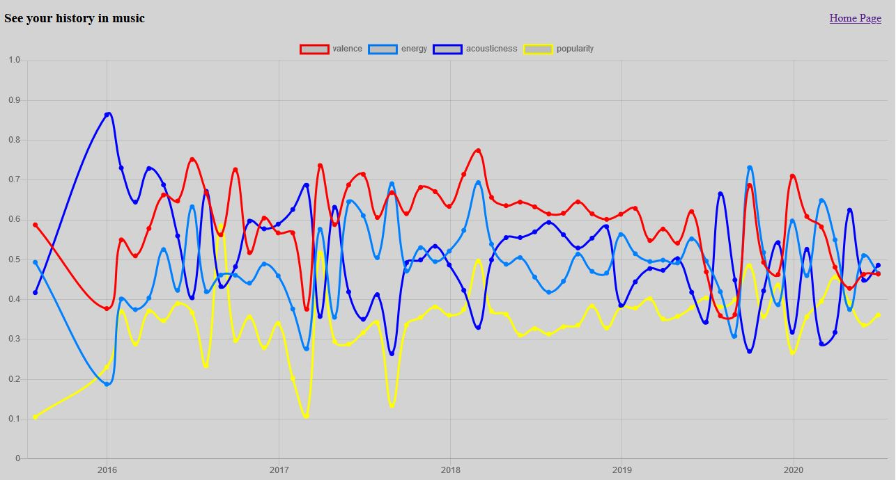

# musical-taste
https://wong-justin.glitch.me/musical.html

Looks at a user's Spotify songs and listening history. See change in music taste over time.

### Usage
1. Go to site and authorize your Spotify account to be read
2. Play around with data when it loads

### About
There's enough projects out there that use the Spotify API to see patterns in music taste, 
but hardly any of them feature change over time. 

This project lets you explore how your taste in music changed over time. 
Interactive chart tracks song attributes like valence (ie happiness) and popularity.

Source code extracted from project hosted on Glitch.

### License
MIT License